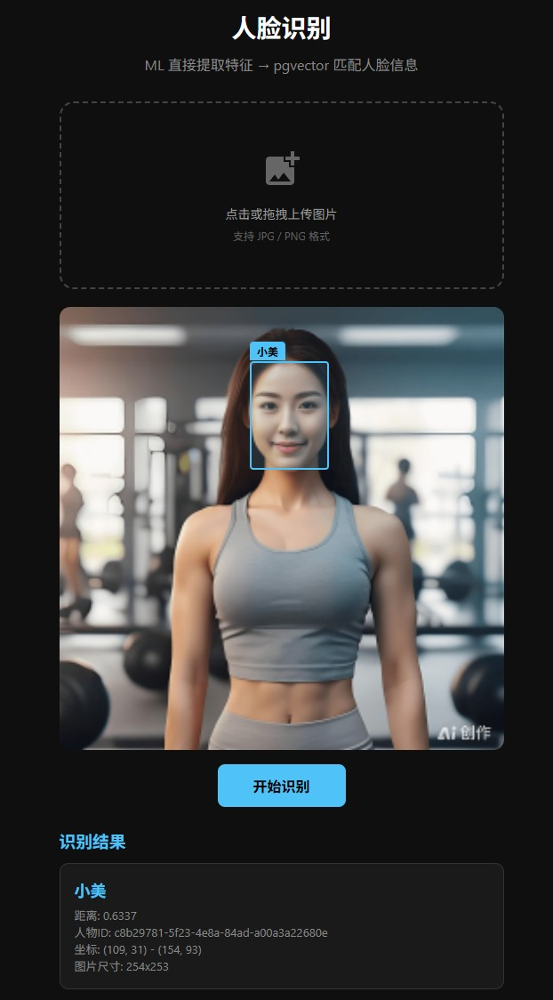

# Immich Face Recognition

<p align="center">
  
</p>
<p align="center">
  <strong>上传图片 → ML 提取特征 → pgvector 匹配 Immich 人脸库</strong><br/>
  返回人脸坐标、人物姓名与相似度距离
</p>

**上传图片 → ML 提取特征 → pgvector 匹配 Immich 人脸库**  
返回人脸坐标、人物姓名与相似度距离

基于 [Immich](https://immich.app/) ML 服务与 PostgreSQL pgvector 的独立人脸识别微服务。上传图片即可检测人脸、提取 embedding，并与 Immich 数据库中已有的人脸向量进行余弦距离匹配，返回人脸坐标及人物信息。

> **只读模式**：本服务不写入数据库，仅查询 `face_search`、`asset_face`、`person`、`asset` 等表。

## 功能特性

- 调用 Immich ML `/predict` 接口，单次请求完成人脸检测与特征提取
- 通过 pgvector 在 Immich 人脸库中检索相似 embedding，复用 Immich 原生匹配逻辑
- 提供 REST API（`POST /api/recognize`）与内置 Web 调试页面（拖拽上传 + 人脸框可视化）
- 支持 Docker / Docker Compose 一键部署
- 自动压缩大图后发送至 ML 服务，降低带宽与推理耗时

## 架构

```
用户上传图片
    │
    ▼
┌──────────────────────────────────────┐
│ 1. 调用 Immich ML /predict           │
│    单次调用同时完成检测 + 识别         │
│    返回 boundingBox + embedding       │
└──────────┬───────────────────────────┘
           │
           ▼
┌──────────────────────────────────────┐
│ 2. 用 embedding 查询 pgvector        │
│    Step1: searchFaces (N 个最近匹配)  │
│    Step2: 找有 personId 的匹配        │
│    Step3: hasPerson=true 兜底搜索     │
└──────────┬───────────────────────────┘
           │
           ▼
┌──────────────────────────────────────┐
│ 3. 去重 + 返回结果                   │
│    同一图中同一人只保留距离最小的匹配   │
│    返回坐标 + personId + personName   │
└──────────────────────────────────────┘
```

## 前置要求


| 依赖                                                            | 说明                               |
| ------------------------------------------------------------- | -------------------------------- |
| [Immich](https://immich.app/)                                 | 已部署并完成人脸索引，ML 服务可访问              |
| PostgreSQL + [pgvector](https://github.com/pgvector/pgvector) | 使用 Immich 同一数据库，需已启用 pgvector 扩展 |
| Go 1.25+                                                      | 仅本地开发编译时需要                       |
| Docker & Docker Compose                                       | 容器化部署时需要                         |


## 快速开始

### Docker Compose（推荐）

1. 克隆仓库并进入项目目录：

```bash
git clone https://github.com/looham/immich_face_recognition.git
cd immich_face_recognition
```

1. 复制环境变量模板并按需修改（参见 `.env.example` 与下方[配置](#配置)）：

```bash
cp .env.example .env
```

1. 启动服务：

```bash
docker compose up -d --build
```

1. 打开浏览器访问 `http://localhost:3080`（端口以 `FACE_RECOGNITION_PORT` 为准）。

> 若 Immich ML 或 PostgreSQL 运行在宿主机，而本服务在 Docker 容器内，可将地址改为 `host.docker.internal`（Windows / macOS），或在 `docker-compose.yml` 中取消 `extra_hosts` 注释。

### 本地开发

```bash
cd face_recognition

# 设置环境变量（或使用 export / .env）
export IMMICH_MACHINE_LEARNING=http://127.0.0.1:3003
export PG_DSN="host=127.0.0.1 port=5432 user=postgres password=postgres dbname=immich sslmode=disable"

go build -o face_recognition .
./face_recognition
```

服务默认监听 `http://0.0.0.0:3080`。

## 配置

### 环境变量


| 环境变量                      | 默认值                                                                                      | 说明                            |
| ------------------------- | ---------------------------------------------------------------------------------------- | ----------------------------- |
| `FACE_RECOGNITION_PORT`   | `3080`                                                                                   | HTTP 服务监听端口                   |
| `IMMICH_MACHINE_LEARNING` | `http://127.0.0.1:3003`                                                                  | Immich ML 服务地址                |
| `ML_MODEL_NAME`           | `antelopev2`                                                                             | 人脸识别模型名称                      |
| `PG_DSN`                  | `host=127.0.0.1 port=5432 user=postgres password=postgres dbname=immich sslmode=disable` | PostgreSQL 连接串（需 pgvector 扩展） |


### 内部参数

以下参数在代码中固定，与 Immich 管理后台人脸识别配置保持一致：


| 参数             | 值     | 说明                  |
| -------------- | ----- | ------------------- |
| `mlMinScore`   | `0.7` | 人脸检测最低置信度           |
| `faceMinFaces` | `3`   | 最少匹配人脸数（minFaces）   |
| `faceMaxDist`  | `0.7` | 余弦距离阈值（maxDistance） |
| `maxImageSize` | `640` | 发送至 ML 的图片最大边长（px）  |


## API

### `POST /api/recognize`

上传图片进行人脸识别。

**请求**

支持两种 Content-Type：

**方式一：`multipart/form-data`**

- 字段: `file` — 图片文件（JPG / PNG）

**方式二：`application/json`**

```json
{
  "base64": "<base64 编码的图片内容>",
  "fileName": "photo.jpg"
}
```

- `base64`（必填）：图片的 Base64 字符串，支持纯 Base64 或 `data:image/jpeg;base64,...` 格式
- `fileName`（可选）：返回结果中的文件名，默认 `image.jpg`

**响应示例**

成功（200）：

```json
{
  "fileName": "photo.jpg",
  "totalFaces": 2,
  "faces": [
    {
      "boundingBoxX1": 683,
      "boundingBoxY1": 748,
      "boundingBoxX2": 763,
      "boundingBoxY2": 851,
      "imageWidth": 1920,
      "imageHeight": 1080,
      "score": 0.88,
      "personId": "55215f39-ccac-478b-a9a0-b38f3dde22b6",
      "personName": "张三",
      "distance": 0.35
    },
    {
      "boundingBoxX1": 120,
      "boundingBoxY1": 200,
      "boundingBoxX2": 180,
      "boundingBoxY2": 280,
      "imageWidth": 1920,
      "imageHeight": 1080,
      "score": 0.82,
      "distance": 0.61
    }
  ]
}
```

无人脸（200）：

```json
{
  "fileName": "photo.jpg",
  "totalFaces": 0,
  "faces": []
}
```

错误响应：


| 状态码   | 说明     | 示例                             |
| ----- | ------ | ------------------------------ |
| `400` | 请求参数错误 | `{ "error": "请上传图片文件" }`       |
| `500` | 服务内部错误 | `{ "error": "ML人脸检测失败: ..." }` |


### `GET /`

内置 Web 页面，支持拖拽上传与人脸框可视化。

**curl 示例**

```bash
# multipart/form-data
curl -X POST http://localhost:3080/api/recognize \
  -F "file=@/path/to/photo.jpg"

# application/json (base64)
curl -X POST http://localhost:3080/api/recognize \
  -H "Content-Type: application/json" \
  -d "{\"base64\":\"$(base64 -w0 /path/to/photo.jpg)\",\"fileName\":\"photo.jpg\"}"
```

## 人脸匹配逻辑

本服务遵循 Immich Server `person.service.ts` 中 `handleRecognizeFaces` 的匹配策略：

1. **searchFaces**：用 embedding 在 `face_search` 中搜索最近的 N 个匹配（`faceMinFaces`），过滤距离 ≤ `faceMaxDist`
2. **找有 personId 的匹配**：在结果中找到第一个已分配 `personId` 的人脸，复用该 person
3. **hasPerson 兜底搜索**：若未找到有 personId 的匹配，再搜索 `personId IS NOT NULL` 的最近一条
4. **去重**：同一张图中同一个 `personId` 只保留距离最小的匹配

## 数据结构

### FaceResult


| 字段              | 类型      | 说明                |
| --------------- | ------- | ----------------- |
| `boundingBoxX1` | int     | 人脸框左上角 X 坐标（原图像素） |
| `boundingBoxY1` | int     | 人脸框左上角 Y 坐标（原图像素） |
| `boundingBoxX2` | int     | 人脸框右下角 X 坐标（原图像素） |
| `boundingBoxY2` | int     | 人脸框右下角 Y 坐标（原图像素） |
| `imageWidth`    | int     | 原图宽度（像素）          |
| `imageHeight`   | int     | 原图高度（像素）          |
| `score`         | float64 | 人脸检测置信度           |
| `personId`      | string  | 匹配到的人物 ID，未匹配时省略  |
| `personName`    | string  | 匹配到的人物名称，未匹配时省略   |
| `distance`      | float64 | pgvector 余弦距离，供调试 |


### 依赖的数据库表


| 表             | 用途                                |
| ------------- | --------------------------------- |
| `face_search` | 存储 embedding 向量（pgvector），用于相似度搜索 |
| `asset_face`  | 存储人脸记录（boundingBox + personId）    |
| `person`      | 存储人物信息（name 等）                    |
| `asset`       | 存储图片资产，用于过滤已删除的记录                 |


## 项目结构

```
immich_face_recognition/
├── Dockerfile              # 多阶段构建镜像
├── docker-compose.yml      # Compose 编排
├── .env.example            # 环境变量模板
├── start.sh                # 容器入口脚本
├── LICENSE
├── README.md
└── face_recognition/
    ├── main.go             # 服务主程序
    ├── go.mod / go.sum
    ├── templates/
    │   └── index.html      # Web 调试页面
    └── README.md           # 模块级说明文档
```

## 开发

```bash
cd face_recognition
go mod download
go run .
```

日志目录：`face_recognition/logs/`（Docker 部署时挂载至 `/app/logs`）。

### 前端人脸框绘制

Web 页面根据 `boundingBox` 与原图尺寸计算显示坐标：

```javascript
const scaleX = displayWidth / face.imageWidth;
const scaleY = displayHeight / face.imageHeight;
const x = face.boundingBoxX1 * scaleX;
const y = face.boundingBoxY1 * scaleY;
const w = (face.boundingBoxX2 - face.boundingBoxX1) * scaleX;
const h = (face.boundingBoxY2 - face.boundingBoxY1) * scaleY;
```

## 相关项目

- [Immich](https://github.com/immich-app/immich) — 自托管照片与视频管理
- [pgvector](https://github.com/pgvector/pgvector) — PostgreSQL 向量相似度搜索扩展

## 免责声明

本项目为 Immich 生态的**独立扩展**，与 Immich 官方无隶属关系。使用前请确保遵守 Immich 及相关依赖的许可证条款。本服务以只读方式访问 Immich 数据库，不会修改你的人脸或人物数据。

## 许可证

本项目采用 [MIT License](LICENSE) 开源。

## 贡献

欢迎提交 Issue 与 Pull Request。提交前请确保：

1. 代码可在本地或 Docker 环境中正常构建运行
2. 不引入硬编码的内网地址或敏感凭据
3. 变更说明清晰，便于审查

